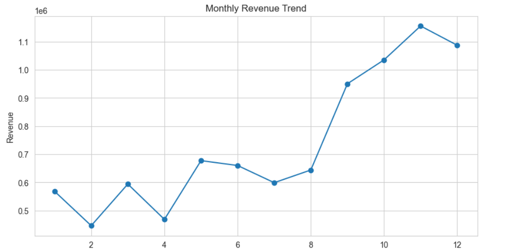
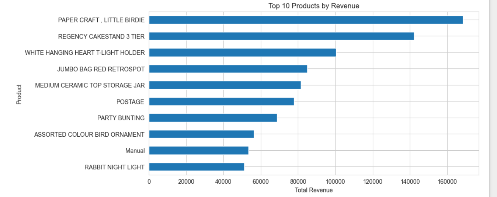
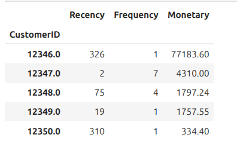

# 🧩 Retail Sales Intelligence

## 📌 Project Overview

**Retail Sales Intelligence** is a data analysis project focused on extracting business insights from an e-commerce transactional dataset.

The goal of this project is to simulate a real-world business analytics workflow by analyzing retail sales data to understand:

* Best-selling products
* Customer purchasing behavior
* Sales trends over time
* Geographic sales distribution

This project demonstrates end-to-end **Data Analysis & Exploratory Data Analysis (EDA)** skills using Python.

---

## 🎯 Objectives

* Clean and prepare raw transactional data
* Perform Exploratory Data Analysis (EDA)
* Generate business-oriented insights
* Create professional data visualizations
* Communicate findings in a business context

---

## 📊 Dataset

**Online Retail Dataset — [UCI Machine Learning Repository](https://archive.ics.uci.edu/ml/datasets/online+retail)**

The dataset contains transactions from a UK-based online retail store selling gift items between December 2010 and December 2011.

Main Features:

* `InvoiceNo` — Transaction ID
* `StockCode` — Product ID
* `Description` — Product name
* `Quantity` — Number of items purchased
* `InvoiceDate` — Transaction timestamp
* `UnitPrice` — Product price
* `CustomerID` — Customer identifier
* `Country` — Customer country

---

## 🧠 Skills Demonstrated

* Data Cleaning
* Exploratory Data Analysis (EDA)
* Business Insight Generation
* Data Visualization
* Analytical Thinking

---

## 🛠 Tech Stack

* Python
* Pandas
* NumPy
* Matplotlib
* Seaborn
* Plotly
* Jupyter Notebook

---

## 📁 Project Structure

```
retail-sales-intelligence/
│
├── data/           # Raw dataset
├── notebooks/      # Analysis notebooks
├── src/            # Reusable Python scripts
├── README.md
└── requirements.txt
```

---

## 📈 Expected Outcomes

* Professional EDA notebook
* Insightful visualizations
* Business recommendations based on data
* Portfolio-ready data project

---
## 📊 Visualizations

### Monthly Revenue Trend


### Top 10 Products by Revenue


### RFM Customer Segmentation


---

## 🚀 How to Run

```bash
pip install -r requirements.txt
jupyter notebook
```

---

## 📌 Author

Mohammed Bounaama — Data Analytics & AI Projects

